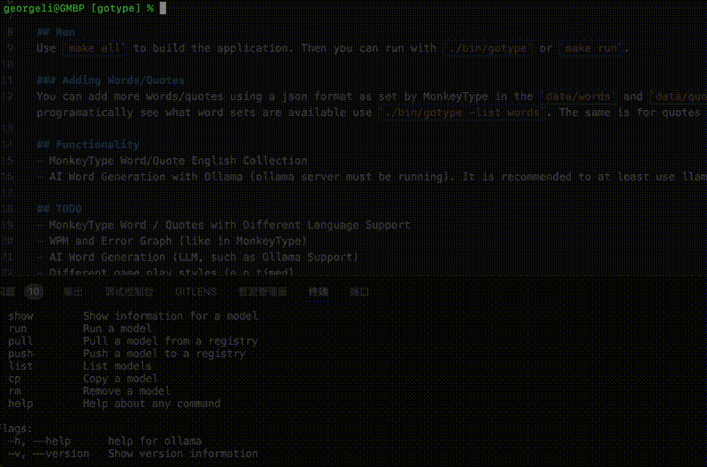

# gotype

A terminal typing test application built using go. Inspired by monkeytype, tt, and typer (trying to build on tt and typer with more functionality as shown in monkeytype). Support interfacing with Ollama llms to generate random words and random quotes.

## Example

## Run
Use `make all` to build the application. Then you can run with `./bin/gotype` or `make run`.

### Adding Words/Quotes
You can add more words/quotes using a json format as set by MonkeyType in the `data/words` and `data/quotes` folders. In order to programatically see what word sets are available use `./bin/gotype -list words`. The same is for quotes and themes.

## Functionality
- MonkeyType Word/Quote English Collection
- AI Word Generation with Ollama (ollama server must be running). It is recommended to at least use llama3.

## TODO
- MonkeyType Word / Quotes with Different Language Support
- WPM and Error Graph (like in MonkeyType)
- AI Word Generation (LLM, such as Ollama Support)
- Different game play styles (e.g timed)